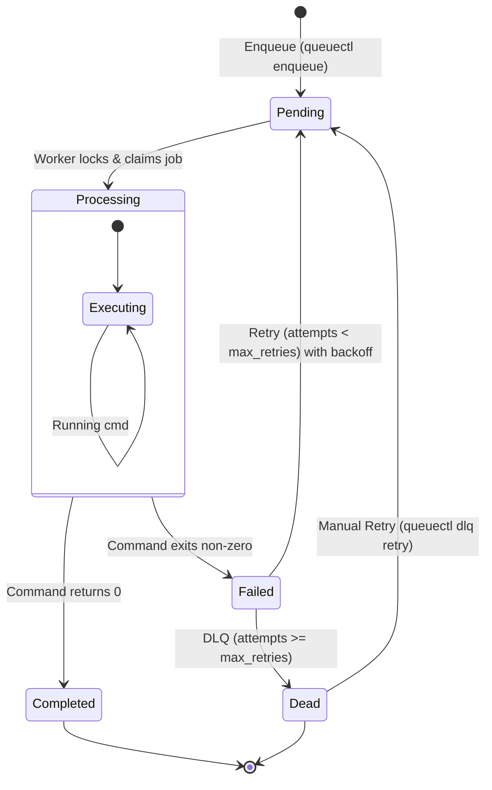

# <p align="center"><a href="https://git.io/typing-svg"></a></p>

A highly reliable, production-ready CLI task scheduler and job queue engine powered by Node.js and SQLite.

`queuectl` provides a robust architecture for managing asynchronous background tasks, utilizing transactional SQLite database operations for multiple parallel workers, automated retries with intelligent exponential backoff, self-healing process recovery, and a beautiful interactive dashboard for status tracking.

### 🎥 Working CLI Demo Video
You can watch a live demo of the CLI system and its various features in action here: [QueueCTL CLI Working Demo](https://drive.google.com/file/d/1hMid7ylr-wsrhKXQY82EO1HE92eJ_w4P/view?usp=sharing)

---

## 🎨 CLI Preview

### 1. Main CLI Help Menu (`queuectl --help`)

```ansi
+--------------------------------------------------------------------------------+
|                                                                                |
|  ██       ██████  ██    ██ ███████ ██    ██ ███████  ██████ ████████ ██        |
|   ██     ██▒▒▒▒██ ██▒   ██▒██▒▒▒▒▒▒██▒   ██▒██▒▒▒▒▒▒██▒▒▒▒▒▒ ▒▒██▒▒▒▒██▒       |
|    ██▒▒  ██▒   ██▒██▒   ██▒█████   ██▒   ██▒█████   ██▒        ██▒   ██▒       |
|   ██ ▒▒  ██▒   ██▒██▒   ██▒██▒▒▒▒  ██▒   ██▒██▒▒▒▒  ██▒        ██▒   ██▒       |
|  ██  ▒▒   ██████▒▒ ██████▒▒███████  ██████▒▒███████  ██████    ██▒   ███████   |
|     ▒▒     ▒▒▒▒▒▒   ▒▒▒▒▒▒  ▒▒▒▒▒▒▒  ▒▒▒▒▒▒  ▒▒▒▒▒▒▒  ▒▒▒▒▒▒    ▒▒    ▒▒▒▒▒▒▒  |
|                                                                                |
+--------------------------------------------------------------------------------+
     by QueueCTL Team

A robust, concurrency-safe Node.js & SQLite job queueing system.

Usage: queuectl [options] [command]

Options:
┌─────────────────┬─────────────────────────────┐
│  -V, --version   │   output the version number  │
└─────────────────┴─────────────────────────────┘

Commands:
┌─────────────────────────────────┬───────────────────────────────────────────────────────────────────────────────────────────┐
│  enqueue [options]               │   Enqueue a new background job using a JSON string or flags                                │
│  worker                          │   Manage background worker processes                                                       │
│    worker start [options]        │   Start a pool of background workers to process jobs                                       │
│    worker stop                   │   Signal all running workers to finish their current job and stop gracefully               │
│  status                          │   Display aggregated counts of jobs grouped by state and active workers                    │
│  list [options]                  │   List individual job rows with timestamps and attempt history                             │
│  dlq                             │   Manage the Dead Letter Queue (jobs in dead state)                                        │
│    dlq list                      │   List all jobs currently in the Dead Letter Queue                                         │
│    dlq retry [options] <jobId>   │   Reset a dead job to pending state with attempts=0 so it re-enters the normal queue flow  │
│  config                          │   Manage global defaults for max-retries and backoff-base                                  │
│    config set <key> <value>      │   Set a global configuration value (e.g. max-retries, backoff-base)                        │
│    config get [key]              │   Get a specific configuration setting or display all if key is omitted                    │
│    config show                   │   Display all current configuration settings                                               │
└─────────────────────────────────┴───────────────────────────────────────────────────────────────────────────────────────────┘

Developed for high-throughput reliability.
```

### 2. Status Dashboard (`queuectl status`)

The `status` command provides a visual overview of active workers and the real-time breakdown of enqueued jobs:

> [!TIP]
> ### 📊 QueueCTL System Status
> 
> **Workers Active:** `👷 3 running` &nbsp;&nbsp;|&nbsp;&nbsp; **Total Jobs:** `📁 12`
> 
> | Job State | Progress Bar | Count / Share |
> | :--- | :--- | :---: |
> | **⏳ Pending** | `██████░░░░░░░░░░░░░░` | **3** (25%) |
> | **⚙️ Processing** | `████░░░░░░░░░░░░░░░░` | **2** (17%) |
> | **✅ Completed** | `██████████░░░░░░░░░░` | **5** (42%) |
> | **⚠️ Failed** | `██░░░░░░░░░░░░░░░░░░` | **1** (8%) |
> | **💀 Dead (DLQ)** | `██░░░░░░░░░░░░░░░░░░` | **1** (8%) |

---

## 🏗️ Architecture & Core Mechanics

### 1. The Job Lifecycle
Jobs transition through five strictly enforced states:
- **`pending`**: Waiting for a worker process to poll and claim it.
- **`processing`**: Claimed and currently executed by an active worker.
- **`completed`**: Command executed successfully (returned exit code `0`).
- **`failed`**: Execution returned a non-zero exit code. The job is scheduled for another attempt based on exponential backoff.
- **`dead`**: Failed permanently. The job is moved to the Dead Letter Queue (DLQ) after exceeding its `max_retries`.



### 2. Multi-Worker Concurrency & Lock Management
To coordinate **parallel worker execution without task duplication**, `queuectl` leverages an embedded **SQLite engine** operating in WAL (Write-Ahead Logging) mode:
* **Atomic Job Acquisition**: Workers wrap job selection in a strict `BEGIN IMMEDIATE` transaction to block concurrent write conflicts.
* **Single-Step Lock/Claim**: The state change is executed using a single, thread-safe `UPDATE...RETURNING` statement. This ensures a job is locked and assigned to a specific worker instantaneously, eliminating execution race conditions even under high worker volumes.

### 3. Fault-Tolerance & Self-Healing Workers
If a worker crashes or is abruptly killed (e.g., system reboot, `kill -9`), the jobs assigned to it won't get stranded in the `processing` state. The queue handles worker failures dynamically:
* **Worker Registry**: Each worker process logs its PID (Process ID) and activity status in the database.
* **Liveliness Audits**: Prior to polling new tasks, active workers audit other registered workers. It checks process status using `process.kill(pid, 0)` to verify the target OS process is still running.
* **Automatic Recovery**: If a worker process is found to have terminated, the auditing worker removes it from the registry and immediately rolls back all jobs locked by it to the `pending` state, allowing the surviving worker pool to process them.

---

## ⚙️ Setup Instructions

### Prerequisites
- **Node.js** (v18.x or higher)
- **npm** (v9.x or higher)

### Installation
1. Clone the repository and navigate to the directory:
   ```bash
   git clone https://github.com/janvee1201/QueueCTL.git
   cd queuectl
   ```
2. Install dependencies:
   ```bash
   npm install
   ```
3. Link the package globally so you can use the `queuectl` command from anywhere:
   ```bash
   npm link
   ```

---

## 💻 CLI Commands & Usage Examples

### 1. Add Jobs to the Queue
Enqueue jobs using the `enqueue` command. You can pass raw JSON or use command-line options.

```bash
# Using raw JSON
queuectl enqueue '{"id":"job-01","command":"echo hello"}'

# Using helper options
queuectl enqueue --command "sleep 5" --retries 5 --backoff 2000
```

### 2. Run Workers
Start a pool of background worker processes.

```bash
# Start 3 parallel workers that run indefinitely, polling for jobs
queuectl worker start --count 3

# Start 1 worker that processes everything in the queue and exits automatically when empty
queuectl worker start --count 1 --drain
```

### 3. Gracefully Stop Workers
```bash
# Signal all workers globally to stop after finishing their current execution
queuectl worker stop
```

### 4. Monitor Status
```bash
# Show the interactive dashboard of jobs and running workers
queuectl status
```

### 5. List Jobs
```bash
# List all jobs in the database
queuectl list

# Filter jobs by state
queuectl list --state failed
```

### 6. Manage Dead Letter Queue (DLQ)
```bash
# List all dead jobs
queuectl dlq list

# Re-enqueue a dead job back to pending
queuectl dlq retry <jobId>
```

### 7. View & Modify Configuration
```bash
# Show current defaults
queuectl config show

# Update global configuration values
queuectl config set max-retries 5
queuectl config set backoff-base 2000
```

---

## 🧪 Testing

The codebase has complete unit and integration test coverage built using **Jest**. Tests run against a separate isolated test database.

Run the test suite:
```bash
npm test
```

### Demo Testing Steps

To manually verify and test the job queue functionality, follow these demo steps:

1. **Enqueue a Job**: Add a job to the queue:
   ```bash
   queuectl enqueue '{"id":"demo-job","command":"echo Hello World"}'
   ```
2. **Verify Job Insertion**: List jobs to confirm it was added:
   ```bash
   queuectl list
   ```
3. **Start Workers**: Run workers to pick up and process the enqueued job:
   ```bash
   queuectl worker start --count 1
   ```
4. **Check Status**: Check the job state (should be completed):
   ```bash
   queuectl status
   ```

## 📝 Key Design Assumptions & Trade-offs
1. **SQLite over JSON File**: We chose SQLite instead of flat-file JSON storage to handle true parallel execution. SQLite provides robust, OS-level file locking and ACID transactions that prevent corruption under multi-process read/write operations.
2. **Process ID Check over Heartbeat Sockets**: Rather than spinning up TCP sockets or heavy daemon loops to check worker health, workers verify that PIDs stored in the database are alive. This keeps the application 100% serverless, zero-dependency, and lightweight.
