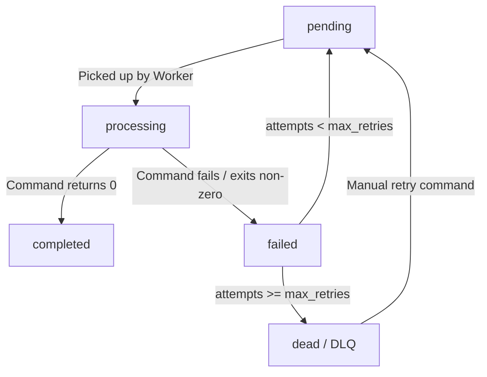

# 🚀 QueueCTL

A modern, production-grade, and concurrency-safe CLI background job queue system built with **Node.js** and **SQLite**.

`queuectl` provides a robust architecture for managing asynchronous background tasks, utilizing atomic transactions for parallel workers, automatic retry logic with exponential backoff, dead letter queue (DLQ) tracking, and an interactive system dashboard.

### 🎥 Working CLI Demo Video
You can watch a live demo of the CLI system and its various features in action here: [QueueCTL CLI Working Demo](https://drive.google.com/file/d/1hMid7ylr-wsrhKXQY82EO1HE92eJ_w4P/view?usp=sharing)

---

## 🎨 CLI Preview

### 1. Main CLI Help Menu (`queuectl --help`)

```ansi
+--------------------------------------------------------------------------------+
|                                                                                |
|  ██       ██████  ██    ██ ███████ ██    ██ ███████  ██████ ████████ ██        |
|   ██     ██▒▒▒▒██ ██▒   ██▒██▒▒▒▒▒▒██▒   ██▒██▒▒▒▒▒▒██▒▒▒▒▒▒ ▒▒██▒▒▒▒██▒       |
|    ██▒▒  ██▒   ██▒██▒   ██▒█████   ██▒   ██▒█████   ██▒        ██▒   ██▒       |
|   ██ ▒▒  ██▒   ██▒██▒   ██▒██▒▒▒▒  ██▒   ██▒██▒▒▒▒  ██▒        ██▒   ██▒       |
|  ██  ▒▒   ██████▒▒ ██████▒▒███████  ██████▒▒███████  ██████    ██▒   ███████   |
|     ▒▒     ▒▒▒▒▒▒   ▒▒▒▒▒▒  ▒▒▒▒▒▒▒  ▒▒▒▒▒▒  ▒▒▒▒▒▒▒  ▒▒▒▒▒▒    ▒▒    ▒▒▒▒▒▒▒  |
|                                                                                |
+--------------------------------------------------------------------------------+
     by QueueCTL Team

A robust, concurrency-safe Node.js & SQLite job queueing system.

Usage: queuectl [options] [command]

Options:
┌─────────────────┬─────────────────────────────┐
│  -V, --version   │   output the version number  │
└─────────────────┴─────────────────────────────┘

Commands:
┌─────────────────────────────────┬───────────────────────────────────────────────────────────────────────────────────────────┐
│  enqueue [options]               │   Enqueue a new background job using a JSON string or flags                                │
│  worker                          │   Manage background worker processes                                                       │
│    worker start [options]        │   Start a pool of background workers to process jobs                                       │
│    worker stop                   │   Signal all running workers to finish their current job and stop gracefully               │
│  status                          │   Display aggregated counts of jobs grouped by state and active workers                    │
│  list [options]                  │   List individual job rows with timestamps and attempt history                             │
│  dlq                             │   Manage the Dead Letter Queue (jobs in dead state)                                        │
│    dlq list                      │   List all jobs currently in the Dead Letter Queue                                         │
│    dlq retry [options] <jobId>   │   Reset a dead job to pending state with attempts=0 so it re-enters the normal queue flow  │
│  config                          │   Manage global defaults for max-retries and backoff-base                                  │
│    config set <key> <value>      │   Set a global configuration value (e.g. max-retries, backoff-base)                        │
│    config get [key]              │   Get a specific configuration setting or display all if key is omitted                    │
│    config show                   │   Display all current configuration settings                                               │
└─────────────────────────────────┴───────────────────────────────────────────────────────────────────────────────────────────┘

Developed for high-throughput reliability.
```

### 2. Status Dashboard (`queuectl status`)

```ansi
┌────────────────────────────────────────────────────────┐
│  SYSTEM DASHBOARD                                      │
├────────────────────────────────────────────────────────┤
│                                                        │
│  Workers Active  ● 3 running                            │
│  Total Jobs      12                                    │
│                                                        │
├────────────────────────────────────────────────────────┤
│  JOB BREAKDOWN                                         │
├────────────────────────────────────────────────────────┤
│                                                        │
│  ● Pending       ██████░░░░░░░░░░░░░░  3/12            │
│  ◎ Processing    ████░░░░░░░░░░░░░░░░  2/12            │
│  ✓ Completed     ████████░░░░░░░░░░░░  5/12            │
│  ▲ Failed        ██░░░░░░░░░░░░░░░░░░  1/12            │
│  × Dead (DLQ)    ██░░░░░░░░░░░░░░░░░░  1/12            │
│                                                        │
└────────────────────────────────────────────────────────┘
```

---

## 🏗️ Architecture & Core Mechanics

### 1. The Job Lifecycle
Jobs transition through five strictly enforced states:
- **`pending`**: Waiting for a worker process to poll and claim it.
- **`processing`**: Claimed and currently executed by an active worker.
- **`completed`**: Command executed successfully (returned exit code `0`).
- **`failed`**: Execution returned a non-zero exit code. The job is scheduled for another attempt based on exponential backoff.
- **`dead`**: Failed permanently. The job is moved to the Dead Letter Queue (DLQ) after exceeding its `max_retries`.



### 2. Concurrency Control & Locking
To safely run **multiple worker processes in parallel without duplicate execution**, `queuectl` uses an embedded **SQLite database** with WAL (Write-Ahead Logging) enabled.
- Job picking is made atomic via a SQLite `BEGIN IMMEDIATE` transaction.
- When acquiring a job, the worker executes a single `UPDATE...RETURNING` statement to lock and claim a `pending` job in one step, preventing race conditions even with dozens of parallel workers.

### 3. Self-Healing & Dead Process Recovery
If a worker process is force-killed (e.g., via `kill -9` or a power loss), it will leave its assigned job stuck in the `processing` state forever. `queuectl` handles this gracefully:
- **Registry Heartbeat Check**: Every worker registers its PID and status in the database.
- **Active Process Verification**: Before picking up new jobs, workers check if the PIDs of other "busy" workers are still running using `process.kill(pid, 0)`.
- **Automatic Job Reclamation**: If a worker process is detected as dead, its entry is cleaned up and all jobs locked by it are immediately reset to `pending` so they can be re-run by the remaining pool.

---

## ⚙️ Setup Instructions

### Prerequisites
- **Node.js** (v18.x or higher)
- **npm** (v9.x or higher)

### Installation
1. Clone the repository and navigate to the directory:
   ```bash
   git clone https://github.com/KrishnaGupta2403/QueueCTL.git
   cd queuectl
   ```
2. Install dependencies:
   ```bash
   npm install
   ```
3. Link the package globally so you can use the `queuectl` command from anywhere:
   ```bash
   npm link
   ```

---

## 💻 CLI Commands & Usage Examples

### 1. Add Jobs to the Queue
Enqueue jobs using the `enqueue` command. You can pass raw JSON or use command-line options.

```bash
# Using raw JSON
queuectl enqueue '{"id":"job-01","command":"echo hello"}'

# Using helper options
queuectl enqueue --command "sleep 5" --retries 5 --backoff 2000
```

### 2. Run Workers
Start a pool of background worker processes.

```bash
# Start 3 parallel workers that run indefinitely, polling for jobs
queuectl worker start --count 3

# Start 1 worker that processes everything in the queue and exits automatically when empty
queuectl worker start --count 1 --drain
```

### 3. Gracefully Stop Workers
```bash
# Signal all workers globally to stop after finishing their current execution
queuectl worker stop
```

### 4. Monitor Status
```bash
# Show the interactive dashboard of jobs and running workers
queuectl status
```

### 5. List Jobs
```bash
# List all jobs in the database
queuectl list

# Filter jobs by state
queuectl list --state failed
```

### 6. Manage Dead Letter Queue (DLQ)
```bash
# List all dead jobs
queuectl dlq list

# Re-enqueue a dead job back to pending
queuectl dlq retry <jobId>
```

### 7. View & Modify Configuration
```bash
# Show current defaults
queuectl config show

# Update global configuration values
queuectl config set max-retries 5
queuectl config set backoff-base 2000
```

---

## 🧪 Testing

The codebase has complete unit and integration test coverage built using **Jest**. Tests run against a separate isolated test database.

Run the test suite:
```bash
npm test
```

### Reference Demo Tests

Below is an illustrative reference of how integration scenarios are structured and verified programmatically within `tests/integration.test.js`:

```javascript
const queueManager = require('../queue/queueManager');
const { executeCommand } = require('../worker/executor');
const { JobState } = require('../models/Job');

describe('Job Queue Integration Scenarios', () => {
  // Scenario 1: Successful Job execution and state transitions
  test('Successful Job execution and state transitions', async () => {
    // 1. Enqueue job
    const job = await queueManager.addJob({ command: 'echo success' });
    expect(job.state).toBe(JobState.PENDING);

    // 2. Worker picks up job atomically
    const processingJob = await queueManager.pickNextJob('worker-demo');
    expect(processingJob.id).toBe(job.id);
    expect(processingJob.state).toBe(JobState.PROCESSING);
    expect(processingJob.locked_by).toBe('worker-demo');

    // 3. Executor runs command
    const result = await executeCommand(processingJob.command);
    expect(result.success).toBe(true);

    // 4. Mark job completed
    const completedJob = await queueManager.markCompleted(processingJob.id);
    expect(completedJob.state).toBe(JobState.COMPLETED);
    expect(completedJob.locked_by).toBeNull();
  });
});
```

---

## 📝 Key Design Assumptions & Trade-offs
1. **SQLite over JSON File**: We chose SQLite instead of flat-file JSON storage to handle true parallel execution. SQLite provides robust, OS-level file locking and ACID transactions that prevent corruption under multi-process read/write operations.
2. **Process ID Check over Heartbeat Sockets**: Rather than spinning up TCP sockets or heavy daemon loops to check worker health, workers verify that PIDs stored in the database are alive. This keeps the application 100% serverless, zero-dependency, and lightweight.
