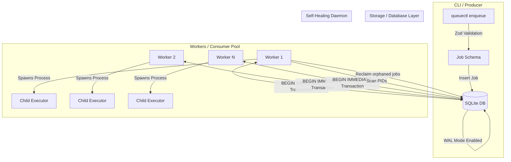

# 🏗️ QueueCTL Design Document & Architecture Tutorial

Welcome to the design documentation for **QueueCTL**—a lightweight, concurrency-safe, serverless background job queueing system built entirely with **Node.js** and **SQLite** (using Write-Ahead Logging/WAL mode).

This document serves as both a high-level architectural overview and a detailed technical tutorial on how the queue guarantees reliability, atomicity, and self-healing.

---

## 📌 1. High-Level Architecture Overview

QueueCTL operates on a **producer-consumer architecture** where the CLI acts as the producer (enqueuing jobs) and a set of background process workers act as consumers (polling, executing, and updating jobs).

### System Data Flow



---

## 🗄️ 2. Database Schema

The core storage is managed in `database/queue.db`. We keep it clean and robust by separating concerns into three primary tables: `jobs`, `workers`, and `config`.

### The `jobs` Table
Stores the payload, state, attempt count, scheduling details, and lock metadata for each job.

| Column | Type | Description |
| :--- | :--- | :--- |
| `id` | `TEXT` (Primary Key) | Auto-generated UUID or a custom user-defined string. |
| `command` | `TEXT` | The exact CLI/Shell command line to execute. |
| `state` | `TEXT` | One of: `pending`, `processing`, `completed`, `failed`, or `dead`. |
| `max_retries` | `INTEGER` | Maximum allowed execution attempts before moving to DLQ. |
| `attempts` | `INTEGER` | Number of times this job has been run so far. |
| `backoff_base` | `INTEGER` | Milliseconds used as base value for exponential backoff calculations. |
| `run_at` | `TEXT` (ISO DateTime) | Scheduled execution time (used for retries with backoff). |
| `locked_by` | `TEXT` (Nullable) | The unique `workerId` holding the execution lock on this job. |
| `error_message`| `TEXT` (Nullable) | Holds stderr output or failure reason from the last run. |

### The `workers` Table
Tracks active worker processes, enabling system-wide heartbeat verification.

| Column | Type | Description |
| :--- | :--- | :--- |
| `id` | `TEXT` (Primary Key) | Unique ID generated upon worker startup. |
| `pid` | `INTEGER` | Operating system Process ID of the worker. |
| `status` | `TEXT` | `active` or `stopped`. |
| `last_seen` | `TEXT` (ISO DateTime) | Timestamp of the last status update. |

---

## ⚙️ 3. Core Mechanics: How It Works Under the Hood

### 3.1 Concurrency Control & Atomic Job Picking
**The Problem**: If two workers poll the queue at the same millisecond, they might both try to execute the same job, leading to duplicate executions.
**The Solution**: SQLite WAL mode combined with atomic transactions.

When a worker queries for a job, it executes the following steps in a single atomic transaction:
1. Opens a `BEGIN IMMEDIATE` transaction, which prevents other database writers from locking the database.
2. Selects the first eligible job using criteria: `state = 'pending' AND run_at <= CURRENT_TIMESTAMP`.
3. Updates that job's state to `processing` and sets `locked_by = workerId` in an atomic operation.
4. Closes the transaction.

```sql
-- Conceptual SQLite Query used in repository.js
BEGIN IMMEDIATE;
UPDATE jobs
SET state = 'processing',
    locked_by = ?
WHERE id = (
    SELECT id FROM jobs 
    WHERE state = 'pending' AND datetime(run_at) <= datetime('now')
    LIMIT 1
)
RETURNING *;
COMMIT;
```

---

### 3.2 Self-Healing & Reclaiming Orphaned Jobs
**The Problem**: A worker crashes (e.g., Out Of Memory, `kill -9`, power failure) while processing a job. The job remains locked in the `processing` state forever.
**The Solution**: OS Process Verification.

Before picking up a new job, every worker runs a check:
1. It queries the `workers` table for other workers marked as running.
2. For each worker, it checks if the registered `pid` is still running on the system using `process.kill(pid, 0)` (which checks existence without sending a termination signal).
3. If the process is dead:
   - It deletes the worker from the `workers` table.
   - It updates all jobs locked by that worker: resets `state` back to `pending`, clears `locked_by`, and makes them available for other workers.

---

### 3.3 Retry & Exponential Backoff
When a command fails (returns a non-zero exit code):
1. The worker increments the job's `attempts` count.
2. If `attempts < max_retries`:
   - It calculates a delay using exponential backoff: `delay = backoff_base * (2 ^ (attempts - 1))`.
   - It sets the job's `state` back to `pending`.
   - It updates `run_at` to `datetime('now', +delay milliseconds)`.
3. If `attempts >= max_retries`:
   - The job is marked as `dead` and moves to the Dead Letter Queue (DLQ).

---

## 📂 4. Codebase Architecture

```bash
queuectl/
├── cli/                 # Commander.js CLI Action definitions
│   ├── enqueue.js       # Action: queuectl enqueue
│   ├── worker.js        # Actions: worker start, worker stop
│   └── status.js        # Action: queuectl status
├── queue/               # Core queue domain logic
│   └── queueManager.js  # Coordinates adding, locking, and processing state changes
├── storage/             # Data Layer
│   ├── sqlite.js        # Database setup, connection pooling, and table creation
│   └── repository.js    # Data Access Object containing all raw SQL queries
├── worker/              # Worker execution loop
│   ├── worker.js        # Individual worker instance polling/healing loop
│   └── executor.js      # Runs job shell commands via child_process
└── index.js             # Binary CLI Entry Point
```

---

## 🚀 5. Step-by-Step Lifecycle Tutorial

Let's trace a job's execution journey step-by-step:

### Step 1: Enqueueing
You run:
```bash
queuectl enqueue --command "echo 'Processing data'" --retries 3
```
- `cli/enqueue.js` processes arguments.
- `queue/queueManager.js` validates parameters.
- `storage/repository.js` executes:
  ```sql
  INSERT INTO jobs (id, command, state, max_retries, attempts, backoff_base, run_at)
  VALUES (?, ?, 'pending', 3, 0, 1000, datetime('now'));
  ```

### Step 2: The Worker Loop
A worker starts and initiates its loop:
1. Runs **Self-Healing** checks to ensure there are no dead worker locks.
2. Runs **Job Acquisition**:
   - Acquires the `BEGIN IMMEDIATE` lock.
   - Updates the job `id` to `state = 'processing'` and `locked_by = 'worker-123'`.
3. Executes command:
   - Spawns a child process: `exec("echo 'Processing data'")`.
4. Returns result:
   - Success (exit code `0`) -> Job marked as `completed`.
   - Failure (exit code `1`) -> Job rescheduled or marked `dead`.
